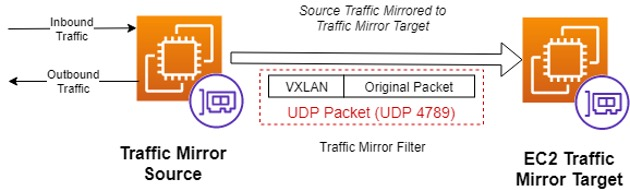
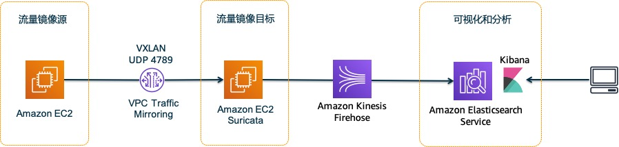
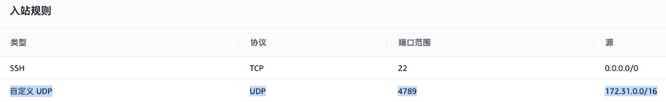
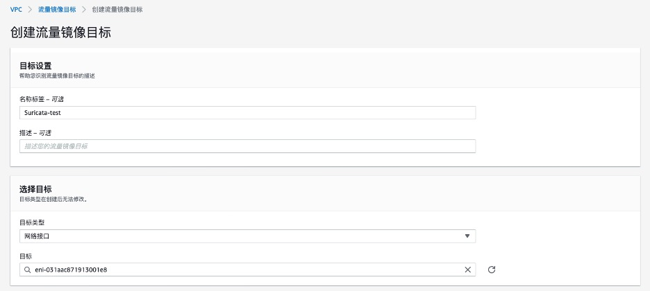
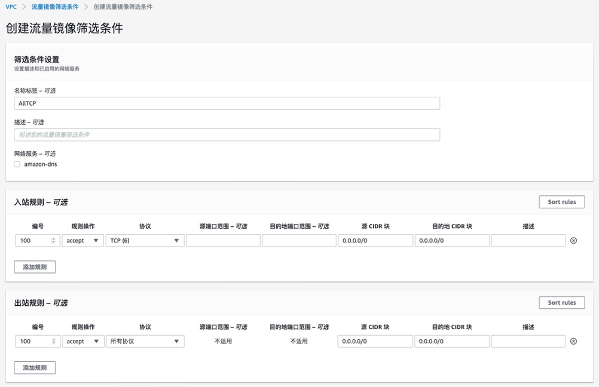
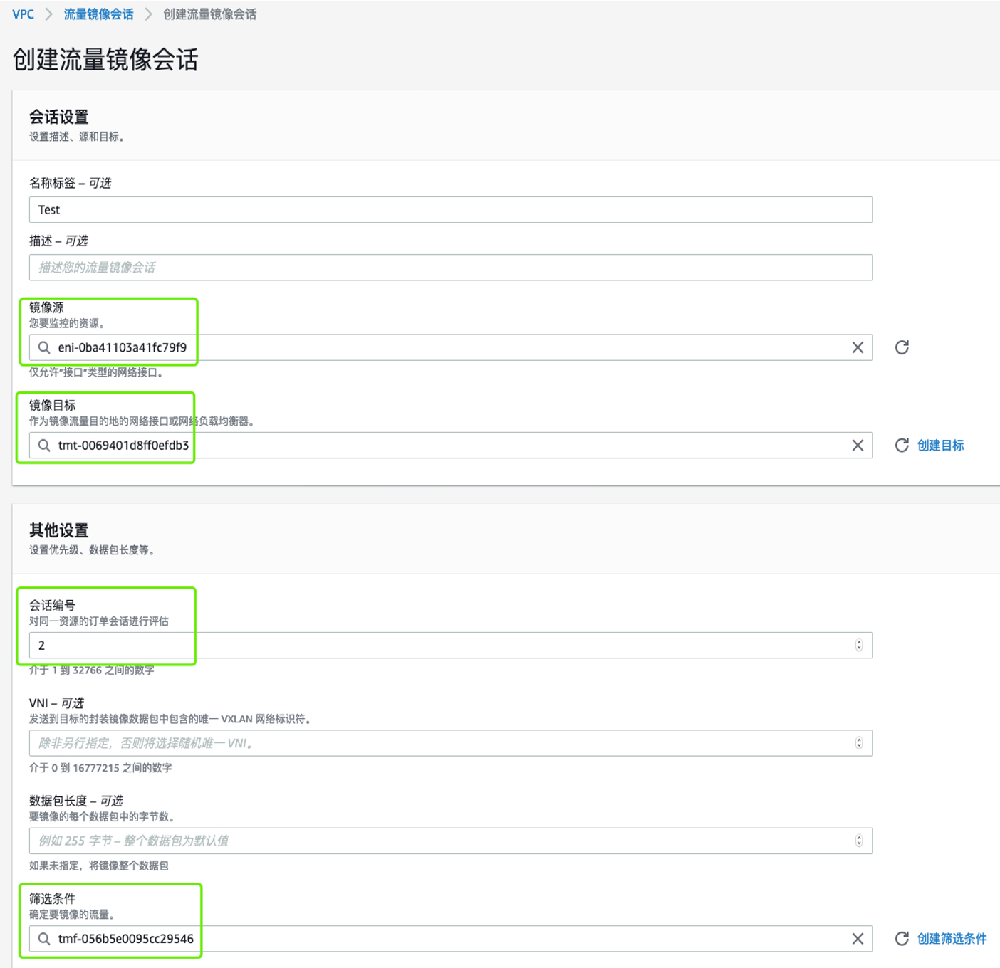
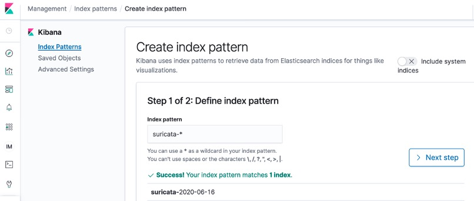
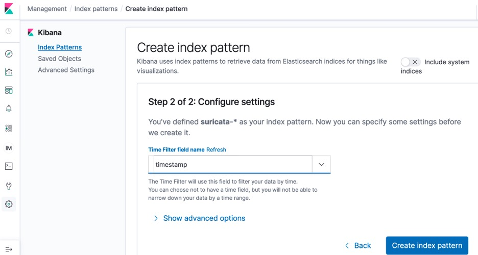
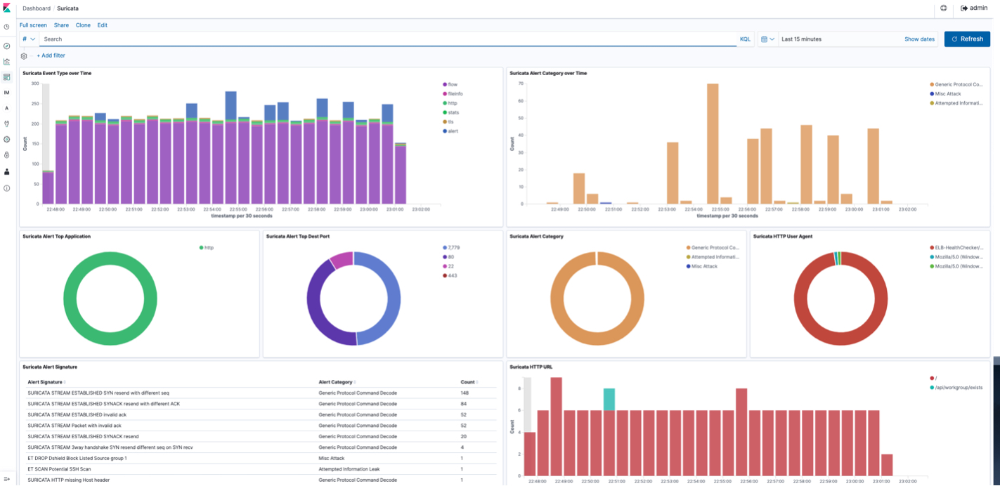
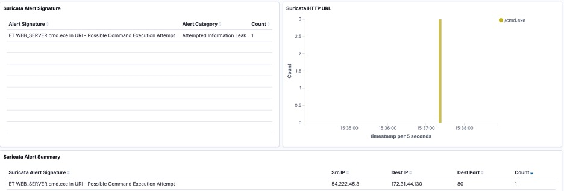

# 借助VPC Traffic Mirroring构建网络入侵检测系统
---
## 前言
---
企业将工作负载部署到云上，安全往往是优先考虑的工作。AWS提供了一系列云原生的安全服务，例如安全组可实现四层的安全防护，AWS WAF可为用户提供托管的Web应用层安全防护，Amazon GuardDuty对VPC网络中的异常流量和AWS账号的异常行为检测。

此外，如果用户希望对云上的网络流量进行实时的安全检测和分析，或希望利用自定义的安全规则实时发现网络中的安全风险，则可以借助VPC流量镜像（Traffic Mirroring），将EC2的网络流量拷贝一份出来，结合安全检测工具对接收到的镜像流量进行实时检测，还可以通过Elasticsearch等可视化工具对入侵检测事件进行可视化展现，或与企业已有的SIEM工具集成，实现统一的安全信息和事件管理。

Marketplace已上线众多专业安全厂商的分析工具，用户可直接订阅并作为流量镜像目标，对捕获的流量进行检测和分析，详细信息请参阅此[博客内容](https://aws.amazon.com/cn/blogs/aws/new-vpc-traffic-mirroring/)。

同时，用户也可以选择开源的，且支持VXLAN解封装的安全分析工具，例如Suricata，Zeek等，自行构建安全入侵检测系统。

本篇文章将介绍如何使用VPC Traffic Mirroring和开源的IDS工具Suricata，搭建一套实时的网络入侵检测系统，利用Kinesis Agent将安全检测日志和告警通过Kinesis Firehose发送到Amazon Elasticsearch，进行可视化分析。

## 1. 部署环境介绍
---
### 1.1 流量镜像
---
流量镜像是一项Amazon VPC功能，可用于从Amazon EC2实例的弹性网络接口复制网络流量，发送到安全分析系统，以用于内容检查，安全威胁监控，故障排除等。

流量镜像目标可以是一台EC2的弹性网络接口，或者通过具备UDP侦听器的NLB网络负载均衡发送到多个目标。流量镜像源和目标可以在同一个VPC，同区域的不同VPC，或者同区域的不同账号。还可以根据协议，端口等定义过滤条件，只复制需要分析的特定流量。

从镜像源复制的流量将被封装在VXLAN（UDP 4789）的数据包中，发送到目标。

<!-- <div align=center></div> -->

<div align=center></div>

### 1.2 Suricata
---
Suricata是一款开源，高性能的网络威胁检测系统，支持IDS，在线IPS等部署模式。Suricata项目由开源组织OISF（Open Information Security Foundation）管理开发和维护。

Suricata使用强大而广泛的规则和签名库来检查网络流量，并具有强大的Lua脚本支持来检测复杂的威胁，支持多线程流量分析，另外通过标准的JSON格式输出检测结果和发现，还可很方便地与现有SIEM，Splunk， Elasticsearch等分析和可视化系统集成。

### 1.3 部署架构图
---
本文以一个最小化的部署环境作为示例，介绍如何使用Traffic Mirroring和开源的IDS工具，并结合Elasticsearch实现对安全入侵事件实现可视化。

<div align=center></div>

1. 部署一台Web服务器作为流量镜像源。
2. 一台EC2安装Suricata作为流量镜像目标。
3. 创建和配置Traffic Mirror，将源的流量复制到镜像目标。
4. 在镜像目标实例上，配置Suricata 规则库实现安全入侵检测。
5. 在镜像目标实例上运行Kinesis Agent，将流量检测的告警和日志信息通过Kinesis Firehose发送到Elasticsearch进行可视化分析。

点击下方Launch Stack，可通过CloudFormation快速自动化部署和配置上述所有组件。部署完成后，根据2.4.2章节中步骤，配置Kibana，导入示例的Kibana Dashboard，用于可视化分析。

<div align=left><a href="https://console.aws.amazon.com/cloudformation/home?region=ap-northeast-1#/stacks/new?stackName=TrafficMirror-Sample&templateURL=https://vpc-traffic-mirror-demo.s3-ap-northeast-1.amazonaws.com/TrafficMirror-Sample.yaml"></a></div>

如果想了解如何一步步手动部署整套环境，或自定义某些环境的配置，请参照下面章节的详细部署步骤。

## 2. 部署步骤
---
### 2.1 安装配置Suricata
---
#### 2.1.1 安装Suricata
---
启动一台Ubuntu 16.04操作系统的EC2（本文以Ubuntu操作为例，Suricata可支持大部分主流Linux），实例的安装组至少要包含UDP 4789端口以从流量镜像源接收VXLAN流量。

<div align=center></div>

```shell
##安装suricata package，会自动安装依赖包
sudo add-apt-repository ppa:oisf/suricata-stable
sudo apt-get update
sudo apt-get install Suricata -y
```
#### 2.1.2 配置Suricata
---
Suricata安装完成后，配置文件目录位于/etc/suricata/。
```shell
##安装Suricata之后，配置文件目录位于/etc/suricata/
/etc/suricata/
├── classification.config		##规则产生的告警分类以及等级的定义
├── reference.config		    ##规则库的来源参考
├── rules			            ##Suricata安装包自带的一些安全规则文件目录
├── suricata.yaml		        ##Suricata配置文件
└── threshold.config		    ##定义规则产生告警的频率阈值，避免不重要的规则产生过多的告警
```
Suricata的所有配置都存放在/etc/suricata/suricata.yaml，配置项非常多，大部分情况使用默认配置即可，具体的配置文件设置可参考[官方文档Configuration章节](https://suricata.readthedocs.io/en/suricata-5.0.3/configuration/index.html)。
```shell
##配置文件目录位于/etc/suricata/，大多情况使用默认配置即可。
## Step 1: inform Suricata about your network
vars:
  # more specific is better for alert accuracy and performance
  address-groups:
    HOME_NET: "[192.168.0.0/16,10.0.0.0/8,172.16.0.0/12]"  ##根据实际情况修改Local subnet
##
## Step 2: select outputs to enable
outputs:
  - eve-log:
      enabled: yes
      xff:
        enabled: no             ##修改为YES，以启动X-forwarded-for的支持，否则在CDN/ALB场景下无法记录真实源IP
##
## Step 4: configure common capture settings
# Linux high speed capture support
## Suricata支持两种高性能抓包引擎af_packet和pf_ring，默认采用af_packet，每个CPU启动一个抓包线程
af-packet:
  - interface: eth0   	        ##默认从eth0接收流量，注意需要与OS的ifconfig中的网卡名称对应
##
## Configure Suricata to load Suricata-Update managed rules.
default-rule-path: /var/lib/suricata/rules  	 ##指定Suricata规则所在目录默认该目录不存在，使用suricata-update可自动创建该目录，并获取最新的rule
rule-files:
  - suricata.rules		        ##默认Suricata使用的rule，如果有自定义的rule，需要在这里手动添加文件名
```
需要手动运行suricata-update，获取最新的规则文件，自动保存在/usr/lib/suricata/suricata.rules文件中。
```shell
ubuntu@ip-172-31-1-10:~$ sudo suricata-update
14/6/2020 -- 04:32:11 - <Info> -- Using data-directory /var/lib/suricata.
14/6/2020 -- 04:32:11 - <Info> -- Using Suricata configuration /etc/suricata/suricata.yaml
14/6/2020 -- 04:32:11 - <Info> -- Using /etc/suricata/rules for Suricata provided rules.
……
14/6/2020 -- 04:32:15 - <Info> -- Loaded 27232 rules.
14/6/2020 -- 04:32:16 - <Info> -- Disabled 14 rules.
14/6/2020 -- 04:32:16 - <Info> -- Enabled 0 rules.
14/6/2020 -- 04:32:16 - <Info> -- Modified 0 rules.
14/6/2020 -- 04:32:16 - <Info> -- Dropped 0 rules.
14/6/2020 -- 04:32:16 - <Info> -- Enabled 141 rules for flowbit dependencies.
14/6/2020 -- 04:32:16 - <Info> -- Creating directory /var/lib/suricata/rules.
14/6/2020 -- 04:32:16 - <Info> -- Backing up current rules.
14/6/2020 -- 04:32:16 - <Info> -- Writing rules to /var/lib/suricata/rules/suricata.rules: total: 27232; enabled: 20394; added: 27232; removed 0; modified: 0
```
Suricata的规则格式如下，
- action，决定匹配规则后要执行的动作，当前部署的IDS模式只有Alert，如果是IPS Inline模式还支持Drop，Reject等
- header，定义匹配规则的协议，IP地址段，端口，方向等
- rule option，括号中的内容，用来定义具体的规则匹配条件
```shell
##Suricata规则格式
alert http $EXTERNAL_NET 80 -> $HOME_NET any (msg:"ET MALWARE CommentCrew Possible APT crabdance backdoor base64 head"; flow:established,to_client; file_data; content:"MS4nJzJ4cHZyeQ=="; metadata: former_category MALWARE; classtype:targeted-activity; sid:2016485; rev:4; metadata:created_at 2013_02_22, updated_at 2013_02_22;)
```
建议定期更新Suricata rules，并在不重启服务的情况下重新加载Rule。
```shell
sudo suricata-update
sudo suricatasc -c reload-rules
```
Suricata自带一套CLI工具，直接在Shell中运行suricata可列出CLI工具可用的参数，通过suricata CLI指定的参数可以覆盖配置文件中的参数，具体可参照[Suricata官方文档Command Line章节](https://suricata.readthedocs.io/en/suricata-5.0.3/command-line-options.html)。
Suricata在安装完成后，会以配置文件中的默认配置自动运行，修改配置文件后，需要重启Suricata service。
```shell
sudo service suricata restart
```
通过suricata --build-info可查看当前Suricata加载的配置信息。

### 2.2 配置Traffic Mirroring
---
#### 2.2.1 创建镜像目标
---
首先创建镜像目标，目标类型选择网络接口，选择安装Suricata的EC2实例ENI作为目标。

<div align=center></div>

#### 2.2.2 创建流量镜像过滤规则
---
只有被规则匹配的流量，才会被被流量镜像复制。如果规则为空，则不复制任何流量。
筛选条件可以根据以下参数指定
- 数据包的方向：入站/出站
- 动作：接受，拒绝
- 协议：L4的协议
- 端口：源/目标端口，或端口范围
- IP地址：源/目标IP CIDR

<div align=center></div>


#### 2.2.3 创建流量镜像会话
---
创建流量镜像会话，选择需要被监控EC2的ENI作为镜像源，并选择前面章节创建的镜像目标和过滤条件。

需要指定会话编号，对于同一个镜像源，可以被镜像到多个目标，但会话编号需要区分开。

注意：镜像源目前只支持基于Nitro的实例类型（例如C5，M5，R5等）

<div align=center></div>

### 2.3 Suricata日志
---
Suricata正常运行时，会在/var/log/suricata/目录下产生一系列日志文件。
```shell
/var/log/suricata/
├── certs
├── core
├── eve.json		    ##以JSON格式产生的所有捕获的flow，alert，stats等日志，以及例如HTTP等协议的应用日志
├── fast.log		    ##检测分析产生的alert日志
├── files
├── stats.log		    ##捕获，处理数据包数量的详细统计
├── suricata.log		##服务运行时的详细日志
└── suricata-start.log	##服务启动时的详细日志
```
其中eve.json中包含了所有捕获的Flow流量日志，安全规则产生的alert告警日志，Stats统计日志，以及各应用层协议的具体日志，例如HTTP access log。

Eve.json包含的日志输出类型，均可在/etc/Suricata/suricata.yaml配置文件的output模块中自定义，具体参照此[Suricata官方文档Output章节](https://suricata.readthedocs.io/en/suricata-5.0.3/output/eve/index.html)。
```shell
##eve.json格式
{
    "timestamp": "2009-11-24T21:27:09.534255",
    "event_type": "alert",
    "src_ip": "192.168.2.7",
    "src_port": 1041,
    "dest_ip": "x.x.250.50",
    "dest_port": 80,
    "proto": "TCP",
    "alert": {
        "action": "allowed",
        "gid": 1,
        "signature_id" :2001999,
        "rev": 9,
        "signature": "ET MALWARE BTGrab.com Spyware Downloading Ads",
        "category": "A Network Trojan was detected",
        "severity": 1
    }
}
```
可将eve.json发送到Elasticsearch，或其他SIEM系统，进行分析和可视化。

### 2.4 配置Kinesis和Elasticsearch
---
首先，请参照官方文档[创建Elasticsearch集群](https://docs.aws.amazon.com/zh_cn/elasticsearch-service/latest/developerguide/es-gsg.html)，和[Kinesis Firehose传输流](https://docs.aws.amazon.com/zh_cn/elasticsearch-service/latest/developerguide/es-aws-integrations.html#es-aws-integrations-fh)，并将Elasticsearch作为Firehose传输流的目标，根据安全最佳实践，建议Elasticsearch和Kinesis Firehose都使用VPC模式，在此不做详细介绍。

假设已经创建完成Elasticsearch集群和Kinesis Firehose传输流，并且Firehose已完成Elasticsearch作为传输目标的相关配置。

本文使用Kinesis Agent，将eve.json文件以流式的方式通过Kinesis Firehose发送到Elasticsearch。

#### 2.4.1 安装配置Kinesis Agent
---
首先在流量镜像目标实例上，安装Kinesis Agent。
```shell
##1. 从 https://github.com/awslabs/amazon-kinesis-agent 下载代理，安装Kinesis Agent需要先安装Java环境。
sudo apt-get install openjdk-8-jdk -y
sudo apt-get install git -y
git clone https://github.com/awslabs/amazon-kinesis-agent.git
##2. 导航到下载目录并运行以下命令来安装代理：
cd amazon-kinesis-agent
sudo ./setup --install
```
另外，运行Kinesis Agent的EC2实例角色需要具备以下IAM策略。
```json
##将xxxxxxx替换为accountID，以ap-northeast-1为例
{
    "Version": "2012-10-17",
    "Statement": [
        {
            "Effect": "Allow",
            "Action": [
                "firehose:PutRecord",
                "firehose:PutRecordBatch"
            ],
            "Resource": [
                "arn:aws:firehose:ap-northeast-1:xxxxxxxxxx:deliverystream/*"
            ]
        },
        {
            "Action": [
                "cloudwatch:PutMetricData"
            ],
            "Resource": "*",
            "Effect": "Allow"
        }
    ]
}
```
修改Kinesis Agent的配置，配置文件位于/etc/aws-kinesis/agent.json，在配置文件中修改需要发送的日志文件，以及日志发送到的Firehose Delivery Stream名称，修改完成后并重启kinesis agent使其生效。
```json
##修改Kinesis Agent的配置文件/etc/aws-kinesis/agent.json如下：
##假设Firehose名称为trafficmirror，请根据自己的设置替换配置（替换region和Delivery Stream 名称）
{
  "cloudwatch.emitMetrics": true,
  "cloudwatch.endpoint": "https://monitoring.ap-northeast-1.amazonaws.com",
  "kinesis.endpoint": "",
  "firehose.endpoint": "https://firehose.ap-northeast-1.amazonaws.com",

  "flows": [
    {
      "filePattern": "/var/log/suricata/eve.json",
      "deliveryStream": "trafficmirror"
    }
  ]
}

##重新kinesis agent生效
sudo service aws-kinesis-agent restart
```

#### 2.4.2 配置Kibana
---
完成上面所有配置后，接下来登录Kibana，完成索引和可视化配置。

##### 2.4.2.1 登录Kibana
---
如果创建Elasticsearch domain时，网络选择VPC模式，可以通过SSH隧道，Nginx Proxy，或者Client VPN，建立本地终端到VPC内部Kibana的访问，具体可参考[此文档](https://aws.amazon.com/premiumsupport/knowledge-center/kibana-outside-vpc-cognito-elasticsearch/)。
本文以SSH隧道为例，使用流量镜像源的EC2作为Proxy，通过SSH隧道访问VPC内部的Kibana。
```shell
##下面是从本地终端建立SSH隧道，访问Kibana的命令
ssh -i ~/.ssh/your-key.pem ec2-user@your-ec2-instance-public-ip -N -L 9200:vpc-your-amazon-es-domain.region.es.amazonaws.com:443

##示例：假设EC2的Public IP为1.1.1.1
##假设Elasticsearch的Endpoint为vpc-test-27kjxll7oy2brhnlqg3uko5p3i.ap-northeast-1.es.amazonaws.com
ssh -i ~/.ssh/your-key.pem ubuntu@1.1.1.1 -N -L 9200: vpc-test-27kjxll7oy2brhnlqg3uko5p3i.ap-northeast-1.es.amazonaws.com:443
```
建立隧道后，使用浏览器访问https://localhost:9200/_plugin/kibana ， 打开Kibana界面。

##### 2.4.2.2 创建Index
---
登录到Kibana之后，进入Management – Index patterns，选择Create index pattern, 输入suricata-*，会自动匹配到index。

<div align=center></div>

选择timestamp字段作为Index的Time Filter。

<div align=center></div>

##### 2.4.2.3 导入Dashboard
---
创建Visualization和Dashboard，对Suricata产生的日志进行分析和可视化展现。

请[点击此处下载](https://vpc-traffic-mirror-demo.s3-ap-northeast-1.amazonaws.com/SuricataKibanaDashboard.ndjson)Kibana的Dashboard示例，并导入到Kibana中。

进入Management – Saved Objects，选择Import，导入上一步中下载的Dashboard示例。

进入Dashboard界面，即可查看当前的流量和告警汇总。

<div align=center></div>

### 2.5 验证测试
---
从本地终端浏览器访问流量镜像源 EC2的Web页面，访问路径后缀为/cmd.exe，模拟一次入侵行为，例如http://1.1.1.1/cmd.exe （请将1.1.1.1替换成实际环境中流量镜像源的IP）。

一分钟左右后从Kibana的Dashboard上查看，会有一条Category为“Attempted Information Leak ”的Alert事件，匹配到Suricata IDS的特征规则为“ET WEB_SERVER cmd.exe In URI - Possible Command Execution Attempt“。

<div align=center></div>

在Suricata实例上，可以在特征规则库/var/lib/suricata/rules/suricata.rules中，查看该规则的具体定义。
```shell
ubuntu@ip-172-31-41-117:~$ sudo grep -rnw 'ET WEB_SERVER cmd.exe In URI - Possible Command Execution Attempt' /var/lib/suricata/rules/suricata.rules
9009:alert http $EXTERNAL_NET any -> $HTTP_SERVERS any (msg:"ET WEB_SERVER cmd.exe In URI - Possible Command Execution Attempt"; flow:to_server,established; content:"/cmd.exe"; http_uri; nocase; reference:url,doc.emergingthreats.net/2009361; classtype:attempted-recon; sid:2009361; rev:7; metadata:created_at 2010_07_30, updated_at 2019_09_27;)
```

## 总结
---
本文以一个最小化的演示环境，介绍了如何使用AWS的流量镜像，和开源的安全分析工具Suricata，对EC2实例的网络流量进行实时检测和可视化分析。

在实际生产环境中，由于网络流量较大，建议使用网络负载均衡连接多个流量镜像目标以分担流量；同时根据实际情况定义过滤条件，只复制实际需要检测的流量，以降低开销；以及可以自定义安全检测规则，及时发现特定的安全风险。

另外除了安全入侵检测之外，流量镜像还可以应用到更广泛的场景，例如利用合作伙伴APM工具，可以实现应用层面以及业务层面上的审计，监控等功能。

